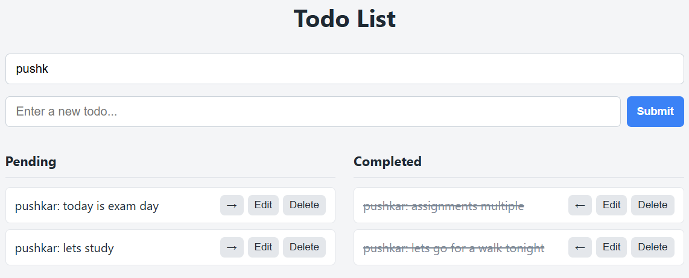
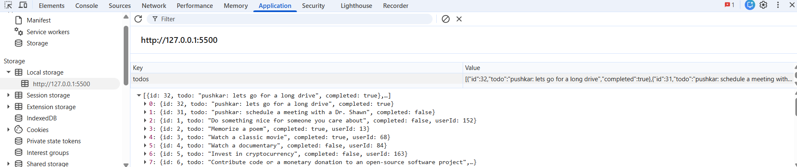

# Todo List

A Todo List app built with **Vanilla JavaScript + HTML + CSS** (no frameworks or
libraries). Todos are seeded from the [DummyJSON](https://dummyjson.com/todos) API,
and all changes persist locally via `localStorage`.

## Screenshots

### Application UI
Two lists (Pending / Completed) with a live search box, add, inline edit, delete,
move-between-lists, and pagination on the Pending list.


### Search / filter
Type in the search box to filter both lists live (case-insensitive substring
match). Filtering runs on every keystroke.



### Persistence (localStorage)
Every change is written to `localStorage` under the `todos` key, so tasks survive a
page refresh. Inspect it in DevTools → **Application → Local Storage**.



## Features

- **Two lists** — Pending and Completed; items move between them when toggled.
- **Search / filter** — a search box filters both lists live as you type
  (case-insensitive substring match). Filtering happens on every keystroke and
  resets the Pending list to page 1 so matches are visible.
- **Add** — type a task and click **Submit** (or press Enter).
- **Delete** — remove any task.
- **Toggle complete** — the arrow button moves a task between lists, driven by the
  `completed` property.
- **Inline edit** — click **Edit** to edit the title in place; **Save** (or Enter)
  to confirm, **Escape** to cancel.
- **Pagination** — the Pending list is paginated client-side (10 per page) with
  Prev / numbered / Next controls.
- **Persistence** — state is saved to `localStorage` and restored on reload.

## Tech & architecture

- Plain **HTML / CSS / JavaScript** — no frameworks or libraries.
- **MVC split into ES modules** under `js/`:
  - **config** — shared constants (API base, storage key, page size).
  - **api** — transport layer: the fetch calls and endpoints.
  - **model** — owns the `todos` state, `localStorage`, and orchestrates the API.
    The only place state mutates.
  - **view** — pure rendering (lists, items, pagination). No business logic.
  - **controller** — wires DOM events to Model methods, then re-renders.
  - **main** — entry point that boots the controller.
- **Event delegation** — one click listener per list container (and one for the
  pagination controls) handles all item buttons efficiently.

## Data handling

The app uses all four CRUD endpoints, but treats the API as best-effort: DummyJSON
is a mock and does **not** persist changes, so after every successful call the local
state is updated manually and saved to `localStorage` (the real source of truth).

| Action | Endpoint |
| --- | --- |
| Fetch (initial seed) | `GET https://dummyjson.com/todos` |
| Add | `POST https://dummyjson.com/todos/add` |
| Edit / Toggle | `PATCH https://dummyjson.com/todos/:id` |
| Delete | `DELETE https://dummyjson.com/todos/:id` |

On first load, todos are fetched from the API and cached in `localStorage`. On
later loads, the cached data is used (so your changes are preserved).

## Running locally

No build step, but the app uses ES modules, so it **must be served over HTTP**
(ES modules don't load from `file://`). Use any static server:

- VS Code **Live Server** (recommended), or
- `npx serve`, or
- `python -m http.server`

Then open the served URL (e.g. `http://127.0.0.1:5500`).

## Project structure

```
.
├── index.html        # markup: search box + add form + Pending/Completed lists + pagination
├── styles.css        # layout and styling
├── js/
│   ├── config.js     # constants (API base, storage key, page size)
│   ├── api.js        # transport layer (fetch calls)
│   ├── model.js      # state + localStorage; orchestrates the API
│   ├── view.js       # rendering only
│   ├── controller.js # wires events; imports model + view
│   └── main.js       # entry point
├── images/           # screenshots used in this README
└── README.md
```
